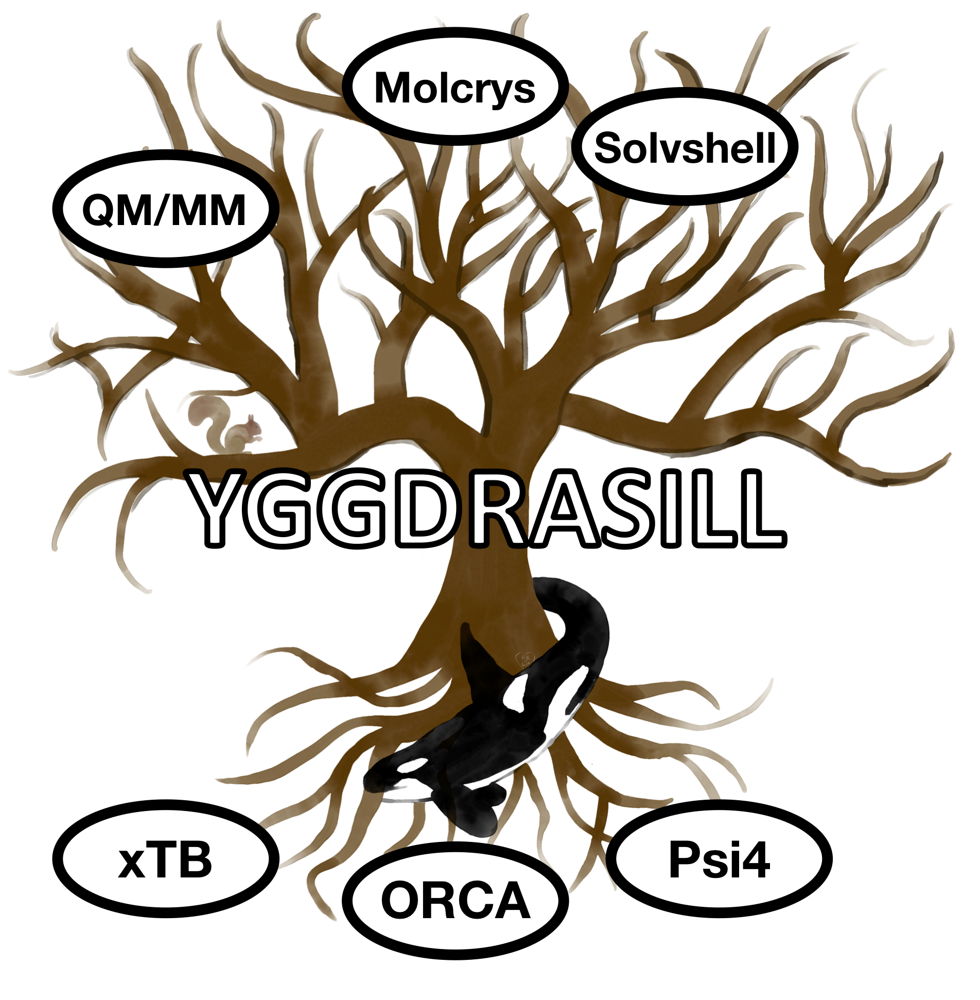

 # Yggdrasill: a computational chemistry environment
Yggdrasill is a Python-based computational chemistry and QM/MM environment, primarily for molecular calculations
in the gas phase, explicit solution, crystal or protein environment. Can do single-point calculations,
geometry optimizations, molecular dynamics (soon), numerical frequencies using a MM, QM or QM/MM Hamiltonian.
Interfaces to popular QM codes: ORCA, xTB, Psi4, PySCF

Requirements:
- Python3 installation
- Numpy
- Matplotlib (for some scientific plotting options).
- Optional Python modules for specific functionality (can be installed via pip or conda):
    - PySCF (C++/Python quantum chemistry code)
    - Psi4 (C++/Python quantum chemistry code)
    - PyBerny (optimizer)
    - geomeTRIC (optimizer)
    - PyFrame (helper tool for Polarizable Embedding functionality)

We recommend Anaconda (https://www.anaconda.com/distribution/) for a good scientific Python distribution. 
Contains Python3, Numpy, SciPy, Matplotlib.

Example:
```sh
from yggdrasill import *
import sys
settings_yggdrasill.init()

coords="""
H 0.0 0.0 0.0
F 0.0 0.0 1.0
"""
#Create fragment
HF_frag=Fragment(coordsstring=coords)

#ORCA settings
orcadir='/opt/orca_4.2.1'
orcasimpleinput="! BP86 def2-SVP Grid5 Finalgrid6 tightscf"
orcablocks="%scf maxiter 200 end"
#ORCA theory object
ORCAcalc = ORCATheory(orcadir=orcadir, fragment=HF_frag, charge=0, mult=1,
                         	orcasimpleinput=orcasimpleinput, orcablocks=orcablocks)
#Call optimzier with ORCAtheory object and fragment
geomeTRICOptimizer(ORCAcalc,HF_frag)
 ```

 ### Current features: 
- **Flexible coordinate input:**
    - coordinate string
    - XYZ file
    - CIF file
    - PDB file
    - Python lists
- **Interfaces to various QM codes:**
    - ORCA (inputfile-based). Parallelization via OpenMPI.
    - xTB (inputfile-based). OpenMP parallelization
    - Psi4 (both as Python library and inputfile-based). OpenMP parallelization.      
    - PySCF (as Python library). OpenMP parallelization.
    - Flexible input structure supporting any Hamiltonian/basis set available in ORCA or xTB (Pyscf/Psi4 less flexible)
    - ORCA parallelization available via OpenMPI
    - To do: Broken-symmetry, ECP-embedding, basis set on specific atoms.
- **Parallelization :**
    - Parallelization via Python multiprocessing.
    - Support for simultaneous single-point jobs.
    - Todo: Numfreq parallelization.
- **Single-point electrostic embedding QM/MM with ORCA, xTB and Psi4.**
    - To do: PySCF
- **Molecular Mechanics (MM) via pointcharges and Lennard-Jones potentials**
    - Flexible definition of charges and Lennard-Jones potentials. Either via flexible forcefield inputfile or 
    in script.
    - Both energy and gradient available.
    - Slow Python version and fast Fortran version available.
    - Limitation: No bonded MM yet.
- **Geometry optimization with multiple optimizers**
     - Knarr, Python LBFGS-optimizer in Cartesian coordinates (credit: Vilhjálmur Ásgeirsson). 
     No internal coordinates. Coming: frozen atoms
     - PyBerny optimizer interface with internal coordinates. Limitation: No frozen atoms or constraints.
     - geomeTRIC interface: powerful optimizer supporting multiple internal coordinates 
     (TRIC, HDLC, DLC etc.), frozen atoms, constraints.
     - To do: DL-FIND interface: powerful optimizer supporting DLC, HDLC internal coordinates, frozen atoms, constraints.
     - To do: Support for additional QM codes besides ORCA: xTB, Psi4
- **Nonbonded QM/MM Geometry optimization:**
    - Possible with geomeTRIC optimizer only.
    - Todo: Knarr support
- **Numerical frequencies: one-point (forward difference) and two-point (central difference)**
     - Partial Hessian possible
     - QM=ORCA supported. Todo: xTB, Psi4 and PySCF
     - QM/MM not yet supported.
     - Todo: Analytical Hessian from ORCA and xTB
- **Hessian analysis**
  - Diagonalization of Hessian (from Yggdrasill or ORCA). Print frequencies and normal modes.
  - Todo: projection of translation/rotational modes
  - Normal mode composition analysis in terms of individual atoms, elements and atom groups.
  - Print vibrational densities of states files (with linebroadening)
  - Mode mapping: compare normal modes of 2 Hessians (e.g. with isotope substitution) for similarity
  - Read/write ORCA-style Hessian files
  - Print XYZ-trajectory file for individual modes
  - Print thermochemistry. TODO: finish
  - Write frequency output as pseudo ORCA-outputfile (enables visualization of modes in Chemcraft/Avogadro)
   
- **Molecular dynamics**
    - To be done
    
- **Submodules:**
    - **molcrys: Automatic Molecular crystal QM/MM**
      - Read-in CIF-file, extract cell information and coordinates of asymmetric unit.
      - Fill-up coordinates of unitcell.
      - Expand unit cell.
      - Create spherical cluster from unitcell (with only whole molecules).
      - Near-automatic fragment indentification.
      - Intelligent reordering of fragments (supports messy CIF-files)
      - Automatic creation of nonbonded MM forcefield (charges and LJ potentials).
      - Self-consistent QM/MM for charge definition of cluster.
      - QM/MM Geometry optimization of central fragment of cluster to capture solid-state geometrical effects.
      - QM/MM Numerical frequencies of central fragment of cluster.
      
    - **solvshell: Multi-shell solvation for redox potentials**
      - Reads snapshots from molecular dynamics trajectory and calculates VIE, VEA, redox pot. or other property.
      - Parallelization over snapshots. Averages over snapshots and finds representative snapshots of trajectory.
      - QM/MM single-points with/without increased QM-region.
      - Bulk correction for aqueous solutions.
      - Automatic procedure for accounting for short-range and long-range polarization effects.
      - Polarizable embedding via Psi4 or PySCF (soon available).
      
    
