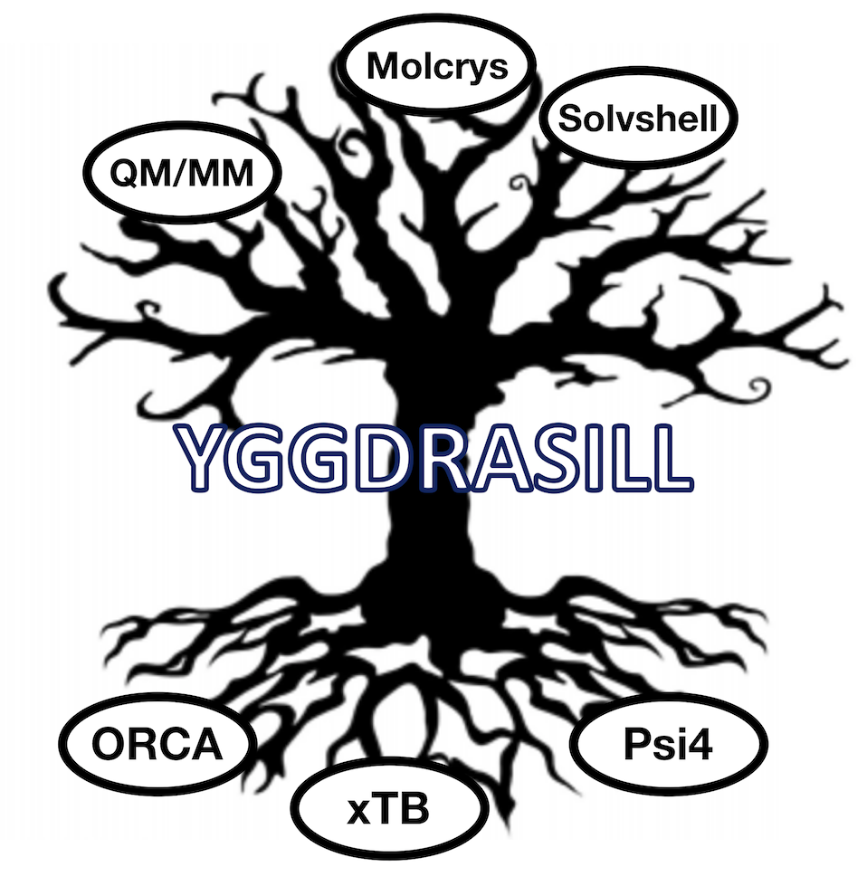

 # Yggdrasill: a computational chemistry environment

 ### Current features: 
- Flexible coordinate input:
    - coordinate string
    - XYZ file
    - CIF file (to be finished)
    - PDB file (TODO)
    - Python lists
- Single-point QM energies with ORCA and xTB:
    - Flexible input structure support any Hamiltonian/basis set available in ORCA or xTB.
    - ORCA parallelization available via OpenMPI
    - To do: Broken-symmetry, ECP-embedding, basis set on specific atoms
- Single-point electrostic embedding QM/MM with ORCA.
    - To do: Lennard-Jones
- Nonbonded Molecular Mechanics (MM) via pointcharges and Lennard-Jones potentials
    - Flexible definition of charges and Lennard-Jones potentials. Either via flexible forcefield inputfile or 
    via 
    - Both energy and gradient available.
    - Limitation: No bonded MM yet.
- Geometry optimization with multiple optimizers
     - Python LBFGS-optimizer in Cartesian coordinates (credit: Vilhjálmur Ásgeirsson). 
     No internal coordinates. Coming: frozen atoms
     - PyBerny optimizer interface with internal coordinates. Limitation: No frozen atoms or constraints.
     - geomeTRIC interface: powerful optimizer supporting multiple internal coordinates 
     (TRIC, HDLC, DLC etc.), frozen atoms, constraints.
     - To do: DL-FIND interface: powerful optimizer supporting DLC, HDLC internal coordinates, frozen atoms, constraints.
     - To do: Support for additional QM codes besides ORCA: xTB, Psi4
- Nonbonded QM/MM Geometry optimization:
    - Possible with geomeTRIC
- Numerical frequencies: one-point (forward difference) and two-point (central difference)
     - Partial Hessian
     - QM=ORCA supported. Todo: xTB
     - QM/MM not yet supported.
     - Todo: Anfreq read-in from ORCA and xTB
- Hessian analysis
  - Diagonalization of Hessian (from Yggdrasill or ORCA). Print frequencies and normal modes.
  - Todo: projection of translation/rotational modes
  - Normal mode composition analysis in terms of individual atoms, elements and atom groups.
  - Print vibrational densities of states files (with linebroadening)
  - Mode mapping: compare normal modes of 2 Hessians (e.g. with isotope substitution) for similarity
  - Read/write ORCA-style Hessian files
  - Print XYZ-trajectory file for individual modes
  - Print thermochemistry. TODO: finish
  - Write frequency output as pseudo ORCA-outputfile (enables visualization of modes in Chemcraft/Avogadro)

  
- Python multiprocessing parallelization functionality for running multiple jobs in parallel.
   - Running many single-point calculations in parallel
   - Running numerical frequency displacements in parallel
- Molecular dynamics
    - To be done
    
- Submodules:
    - molcrys: Automatic Molecular crystal QM/MM
      - Read-in CIF-file, extract cell information and coordinates of asymmetric unit.
      - Fill-up coordinates of unitcell.
      - Expand unit cell.
      - Create spherical cluster from unitcell (with only whole molecules).
      - Near-automatic fragment indentification.
      - Intelligent reordering of fragments (supports messy CIF-files)
      - Automatic creation of nonbonded MM forcefield (charges and LJ potentials).
      - Self-consistent QM/MM for charge definition of cluster.
      - QM/MM Geometry optimization of central fragment of cluster to capture solid-state geometrical effects.
      - QM/MM Numerical frequencies of central fragment of cluster.
      
    - solvshell: Multi-shell solvation for redox potentials
    
