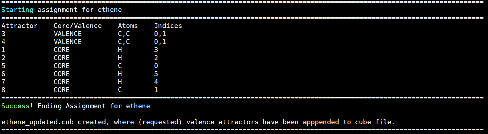

# AutoELF

This is a simple python program, that is designed to speed up the workflow of generating Electron Localisation Function (ELF) plots. This program assumes that the cube and attractors file (.pdb) used as input have been generated using [Multiwfn](http://sobereva.com/multiwfn/). 

Covalent radii used are taken from [here](https://periodictable.com/Properties/A/CovalentRadius.html).

## Installation

1. Download the main project directory.

2. Extract to a suitable location

3. Add parent directory location to PYTHONPATH environment variable, for example:
    ```
    export PYTHONPATH=$HOME/software/python_programming:$PYTHONPATH
    ```
    Where the python_programming directory contains the autoelf directory with all project files.

## Example Usage

1. We start in a directory containing the following files: ethene.cub and ethene.pdb
    - ethene.cub : This is the cube file containing the data to visualise the ELF isosurface, produced by Multiwfn
    - ethene.pdb : This is the raw attractors file produced by Multiwfn, in the .pdb file format

2. We create a .py script named ethene.py containing the following two lines:
    ```
    from autoelf import *
    auto_elf_assign("ethene.cub", "ethene.pdb", interest_atoms=[0,1])
    ``` 
    We have specified the two required positional arguments, cubefile and pdbfile. We have also specified that we are interested in any VALENCE attractors that are assigned to atoms 0 and 1 (the two carbon atoms). Note: atom indices start from 0.

3. Execute command: python3 ethene.py

4. Output:
     

5. What files are produced ?
    - ethene_updated.cub --> Contains ELF isosurface, molecular geometry and VALENCE attractors (all or of interest). This can be visualised in programs such as Chemcraft, Avogadro and VMD.
